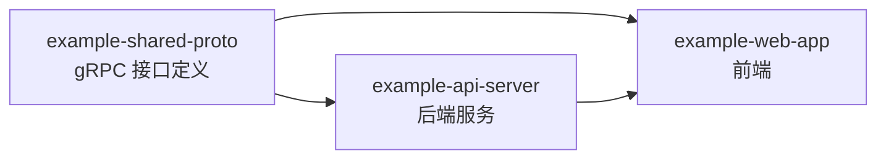

# 首页

> Vault 总入口。Claude 每次开工前先读这里，再跳转到具体项目。

## 项目列表

<!-- 此区域由 /add-project 自动维护 -->

| 项目 | 路径 | 文档入口 | 状态 |
|------|------|---------|------|
| example-api-server | `~/code/example-api-server` | [[项目/example-api-server/概览]] | 进行中 |
| example-web-app | `~/code/example-web-app` | [[项目/example-web-app/概览]] | 进行中 |
| example-shared-proto | `~/code/example-shared-proto` | [[项目/example-shared-proto/概览]] | 维护中 |

## 跨仓库依赖图

**看图说话**：proto 改动会同时影响后端和前端，修 proto 时要联动检查两个下游项目；后端 API 变更会影响前端调用。

## 工作约定

- 跨文件链接使用全路径：`[[项目/<name>/概览]]`
- 项目入口文件统一命名 `概览.md`，不要用裸数字前缀（如 `00-概览.md`）影响图谱辨识
- 修改了代码后用 `/sync-docs` 同步到对应项目文档
- proto 改动后要在两个下游项目的 `activeContext.md` 里登记一条"待联动"

## 关键入口

- [[开发工作流指南]] — Claude + Obsidian 协作机制说明
- [[CLAUDE]] — 给 Claude 的全局指令
- [[AGENTS]] — 给 Codex 的全局指令（可选）
