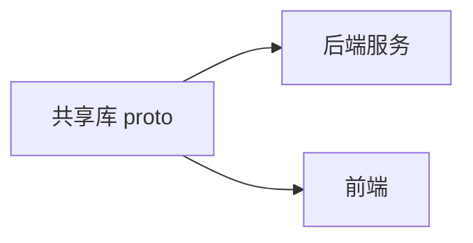

# 首页

> Vault 总入口。Claude 每次开工前先读这里，再跳转到具体项目。

## 项目列表

<!-- 此区域由 /add-project 自动维护 -->

| 项目 | 路径 | 文档入口 | 状态 |
|------|------|---------|------|
| _示例项目_ | `~/code/example` | [[项目/example/概览]] | 进行中 |

## 跨仓库依赖图

<!-- 用 mermaid 或 wikilink 描述项目之间的依赖关系。例如 proto 共享库被多个服务依赖。 -->

## 工作约定

- 跨文件链接使用全路径：`[[项目/<name>/概览]]`
- 项目入口文件统一命名 `概览.md`，不要用裸数字前缀（如 `00-概览.md`）影响图谱辨识
- 修改了代码后用 `/sync-docs` 同步到对应项目文档

## 关键入口

- [[开发工作流指南]] — Claude + Obsidian 协作机制说明
- [[CLAUDE]] — 给 Claude 的全局指令
- [[AGENTS]] — 给 Codex 的全局指令（可选）
